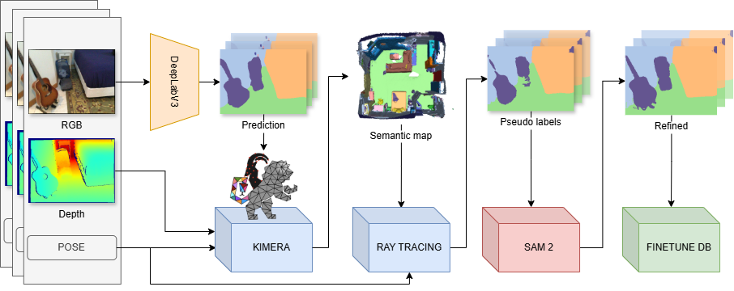

# Raffinamento delle Pseudo-Label in Unsupervised Domain Adaptation utilizzando SAM2

Questo progetto si concentra sul miglioramento dell'**Unsupervised Domain Adaptation (UDA)** per la segmentazione semantica nella percezione robotica. Quando i robot vengono impiegati in nuovi ambienti, spesso affrontano un **domain shift** (ad esempio, passando da dati di addestramento outdoor a scene indoor), che riduce significativamente le prestazioni.

## Il Problema
Le pipeline UDA standard si affidano alle **pseudo-label**: etichette generate automaticamente utilizzate per l'addestramento in assenza di "ground truth". Tuttavia, queste etichette (spesso generate da mappe voxel 3D) sono frequentemente rumorose, squadrate ("blocky") e non rispettano i contorni degli oggetti.

## La Soluzione: Raffinamento con SAM2
Ho implementato una fase di raffinamento utilizzando il **Segment Anything Model (SAM2)**. Essendo un modello zero-shot capace di segmentazione di alta qualità, SAM2 può essere utilizzato per "affilare" le pseudo-label rumorose.

### Strategie di Prompting
Sono state sviluppate due strategie principali per fornire a SAM2 i prompt necessari:
1.  **Strategia Informed**: Utilizza le predizioni iniziali del modello per identificare i centroidi degli oggetti e i "bounding box", fornendo prompt mirati a SAM2.
2.  **Strategia Grid-based**: Campiona l'immagine uniformemente con una griglia di punti, affidandosi alla capacità di SAM2 di segmentare tutto e fondendo poi i risultati con le etichette originali.

## Risultati
Gli esperimenti condotti sul dataset **ScanNet** (mai visto durante l'addestramento) hanno mostrato:
-   **Maggiore Accuratezza**: Incremento significativo della mIoU (Mean Intersection over Union) in tutte le scene testate.
-   **Contorni Migliori**: Definizioni degli oggetti più precise rispetto alle pseudo-label standard mappate in 3D.
-   **Robustezza**: Particolarmente efficace in contesti a bassa risoluzione (voxel grossolani), rendendolo adatto per applicazioni robotiche in tempo reale con limiti hardware.

## Sviluppi Futuri
I prossimi passi prevedono l'integrazione di questo raffinamento zero-shot in un **ciclo di addestramento continuo completamente online**, permettendo ai robot di adattarsi dinamicamente mentre esplorano nuovi spazi.
